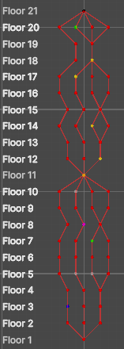

# Graph-Based Map Generation in Unity

This Unity project demonstrates the generation of a map using a graph-based approach. The map consists of multiple floors, each containing various chambers connected by edges. The map is visualized using Unity's Gizmos for easy debugging and understanding of the structure.

*Figure 1: Visualization of the generated map in Unity using Gizmos.*

## Classes and Code Overview

### 1. `Graph<T>`

A generic class representing a graph consisting of nodes of type `T`.

- **Properties:**
  - `List<Node<T>> Nodes`: A list of nodes in the graph.

- **Methods:**
  - `AddNode(T value, Vector3 position, Color nodeColor)`: Adds a node with the specified value, position, and color to the graph.
  - `AddEdge(Node<T> from, Node<T> to)`: Adds an undirected edge between two nodes, making them neighbors.

### 2. `Node<T>`

Represents a node in the graph.

- **Properties:**
  - `T Value`: The value stored in the node.
  - `Vector3 Position`: The position of the node in the 3D space.
  - `Color NodeColor`: The color of the node, used for visualization.
  - `List<Node<T>> Neighbors`: A list of neighboring nodes.

- **Constructor:**
  - Initializes a node with a value, position, and color, and creates an empty list of neighbors.

### 3. `ChamberType`

An enumeration representing different types of chambers that can appear in the map, including `Normal`, `Contest`, `Horde`, `Prophet`, `Blacksmith`, `Random`, `Shop`, and `Boss`.

### 4. `GraphExample`

A Unity MonoBehaviour script responsible for generating the map and visualizing it using Gizmos.

- **Methods:**
  - `Start()`: Initializes the map generation process when the game starts.
  - `GenerateMap()`: Generates the map with multiple floors and chambers, connecting them based on specific rules.
  - `GetChamberColor(ChamberType chamberType)`: Returns a color based on the chamber type for visualization purposes.
  - `GenerateChamber(int floor, int index)`: Determines the type of chamber to generate based on the floor and index.
  - `OnDrawGizmos()`: Visualizes the graph's nodes and edges in the Unity Editor using Gizmos.

## Notes

- The visualization using Gizmos is intended for development and debugging purposes. It will not appear in the final build of the game.
- The map generation logic, including chamber types and connections, can be customized further based on game design requirements.
